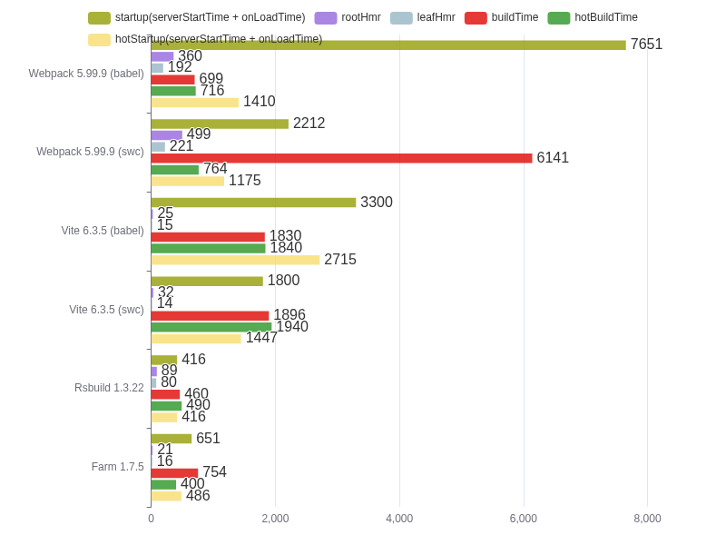
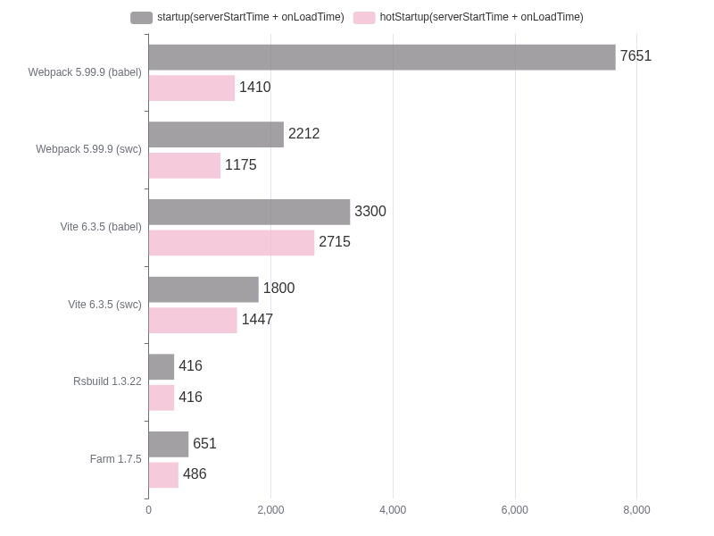
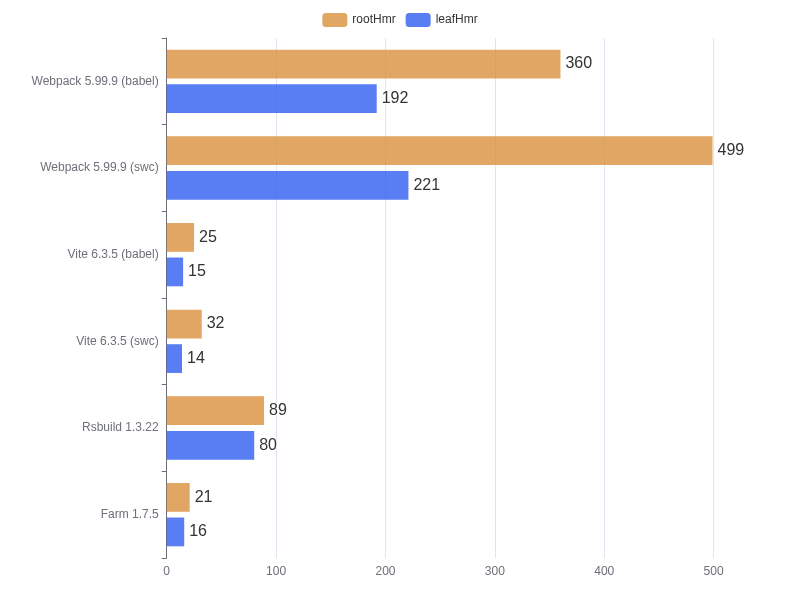
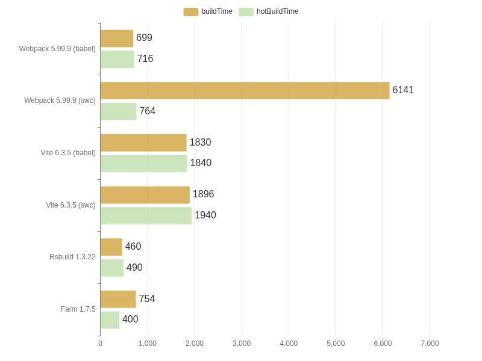

# performance-compare

Benchmarks for [Farm](https://github.com/farm-fe/farm), Rsbuild, Webpack, Vite

> Using Turbopack's bench cases (1000 React components), see
> https://turbo.build/pack/docs/benchmarks

> The `startup time` algorithm is the compilation time plus the time from
> browser loading to page rendering on the browser

> [!IMPORTANT] > **Tips:** Farm compiled a write with incremental cache for the
> first time, The time to write the cache in the current warehouse module
> configuration is approximately 200ms, Rsbuild currently has no caching
> mechanism, so we provide second pass compilation data by default Later, we can
> wait for rspack to implement incremental caching and then we can re-separate
> the entire data,(the second compilation with caching and the first compilation
> without caching)

<!-- > Tested on Linux Mint, 11th Gen Intel(R) Core(TM) i5-11400 @ 2.60GHz, 16GB -->

> Tested on a 12 core AMD EPYC 9634 84-Core Processor - 32GB

```bash
┌─────────────────────────────┬───────────────────────────────────────┬─────────────────┬────────────┬─────────┬─────────┬───────────┐
│ (index)                     │ startup(serverStartTime + onLoadTime) │ serverStartTime │ onLoadTime │ rootHmr │ leafHmr │ buildTime │
├─────────────────────────────┼───────────────────────────────────────┼─────────────────┼────────────┼─────────┼─────────┼───────────┤
│ Farm 1.7.1                  │ '578ms'                               │ '384ms'         │ '193ms'    │ '15ms'  │ '14ms'  │ '704ms'   │
│ Farm 1.7.1 (Hot)            │ '440ms'                               │ '246ms'         │ '194ms'    │ '16ms'  │ '13ms'  │ '354ms'   │
│ Rsbuild 1.2.19              │ '445ms'                               │ '233ms'         │ '212ms'    │ '112ms' │ '92ms'  │ '496ms'   │
│ Rsbuild 1.2.19 (Hot)        │ '440ms'                               │ '230ms'         │ '210ms'    │ '106ms' │ '98ms'  │ '500ms'   │
│ Vite 6.2.2 (swc)            │ '1784ms'                              │ '155ms'         │ '1629ms'   │ '26ms'  │ '14ms'  │ '1933ms'  │
│ Vite 6.2.2 (swc)(Hot)       │ '1451ms'                              │ '157ms'         │ '1294ms'   │ '31ms'  │ '14ms'  │ '1973ms'  │
│ Vite 6.2.2 (babel)          │ '3229ms'                              │ '180ms'         │ '3049ms'   │ '23ms'  │ '17ms'  │ '1893ms'  │
│ Vite 6.2.2 (babel)(Hot)     │ '3021ms'                              │ '149ms'         │ '2872ms'   │ '37ms'  │ '14ms'  │ '1876ms'  │
│ Webpack 5.98.0 (swc)        │ '2356ms'                              │ '1987ms'        │ '369ms'    │ '484ms' │ '218ms' │ '6272ms'  │
│ Webpack 5.98.0 (swc)(Hot)   │ '1265ms'                              │ '897ms'         │ '367ms'    │ '321ms' │ '219ms' │ '709ms'   │
│ Webpack 5.98.0 (babel)      │ '8701ms'                              │ '8358ms'        │ '342ms'    │ '605ms' │ '240ms' │ '700ms'   │
│ Webpack 5.98.0 (babel)(Hot) │ '1472ms'                              │ '1144ms'        │ '328ms'    │ '325ms' │ '221ms' │ '686ms'   │
└─────────────────────────────┴───────────────────────────────────────┴─────────────────┴────────────┴─────────┴─────────┴───────────┘
```

### Full Benchmark



### StartUp Benchmark



### HMR Benchmark



### Production Build Benchmark



Run benchmarks:

```bash
node benchmark.mjs
```

You will see something like:

```txt
bright@bright-MS-7D17:~/opensource/performance-compare$ node benchmark.mjs

Rspack  startup time: 417ms
Turbopack  startup time: 2440.673095703125ms
Webpack  startup time: 7968ms
Vite  startup time: 3712ms
Farm  startup time: 430ms
Turbopack  Root HMR time: 7ms
Farm  Root HMR time: 7ms
Vite  Root HMR time: 42ms
Rspack  Root HMR time: 298ms
Webpack  Root HMR time: 451ms
Farm  Leaf HMR time: 10ms
Turbopack  Leaf HMR time: 11ms
Vite  Leaf HMR time: 22ms
Webpack  Leaf HMR time: 284ms
Rspack  Leaf HMR time: 303ms
```

If you want to start the project with the specified tool, try:

```bash
bun i # install dependencies
bun run benchmark # Run benchmark
```
